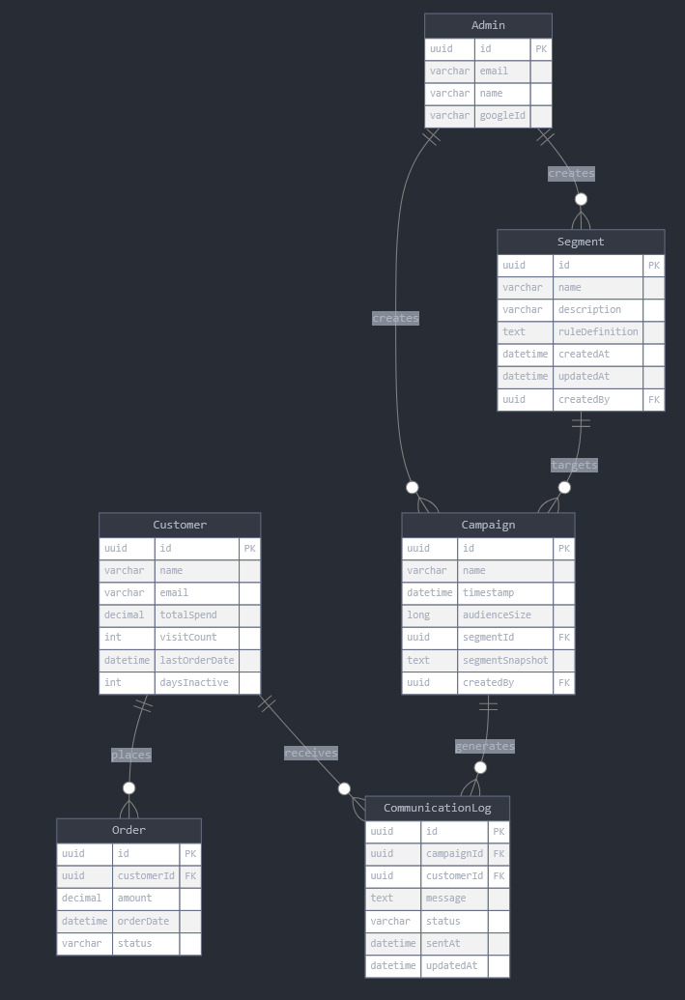
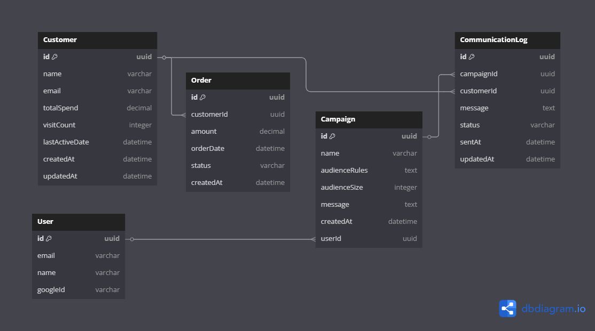
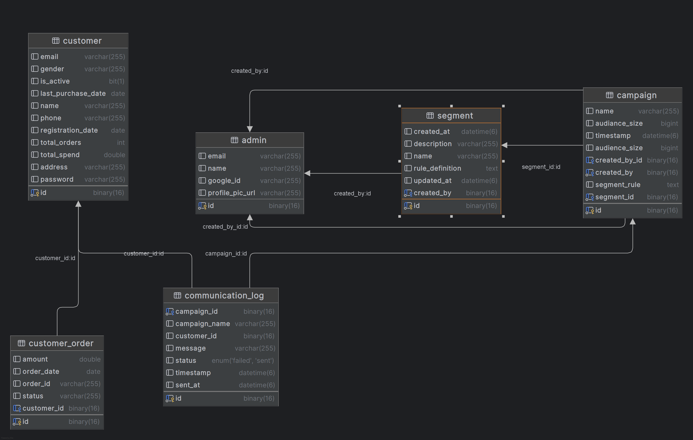

# miniCrm

--- 

## ✅ Brownie Points Update 
- Updated the code with batch processing using Redis Publisher subscriber Model

  ## How It Works Now (flow) -->

  - controller sends batch delivery updates to Redis.

  - Redis passes the updates to the RedisSubscriber.

  - RedisSubscriber updates the status in the database asynchronously which was updating one at a time directly to the DB 

  - using redis docker image to run redis expose to port '6379' 

    ``` docker run --name redis -p 6379:6379 -d redis```
--- 

## Local Setup Instructions

### Prerequisites

* Java 17 or higher
* MySQL 8.0 or higher
* Maven
* Google OAuth credentials

### Steps to Run

1. Clone the repository

```bash
git clone https://github.com/Ritikkumar352/miniCrm.git
cd miniCrm
```

2. Configure Database

* Create a MySQL database named `minicrm`
* Update `application.properties` with your DB credentials

3. Configure Google OAuth

* Go to Google Cloud Console
* Create a project and enable Google OAuth2 API
* Create OAuth 2.0 credentials
* Add authorized redirect URI:

    * `http://localhost:8080/login/oauth2/code/google`
    * Or deployed domain,:-
      `https://main.d3pha96ypv251i.amplifyapp.com/login/oauth2/code/google`
* Add your deployed domain under **Authorized JavaScript Origins**
* Add it under **Authorized Domains** in Firebase (if using Firebase frontend)
* Update `application.properties` with client ID and secret

4. Run the Application

```bash
mvn spring-boot:run
```

---


# STRUCTURE

## 1. Admin

* Admin creates segment rules (e.g., spend > 1000 or joined before 2020)

## 2. Segment

* Stores rules and descriptions
* Filters customers matching those rules
* Displays matching customer count

## 3. Campaign

* Campaign uses a segment to decide target audience
* Contains message template to send to matched users

## 4. Communication Log

* Records message delivery attempts and their statuses (e.g., SENT / FAILED)
* Simulates \~90% success using a dummy delivery API

**Flow:**
**Admin (creates rules)** → **Segment (filters customers)** → **Campaign (uses segment)** → **CommunicationLog (tracks delivery)**

---


## Architecture Diagram

* Visual representation of how the app flows between modules



---

* Planned DB Schema (Design Phase)
  

---

* ER diagram generated after implementing the DB schema  (changed some attributes while implementing**)




---

## Tech Stack & Tools

### Backend

* Java 17
* Spring Boot 3.4.5
* Spring Security
* Spring Data JPA
* MySQL
* Maven

### Frontend

* React
* Tailwind
* Axios

### Development Tools

* IntelliJ IDEA
* VS Code
* Postman
* Git

--- 


## Features

* Register, get all customers paginated, get a customer, update and delete a customer
* OAuth2 login via Google
* Save user to database on first login

## OAuth2

* `OAuthServiceImpl implements OAuth2UserService<R, U>`

    * `R` is the Google OAuth object
    * `U` is the Admin entity (our DB model)
* We cannot directly save OAuth2User to our DB
* Google login is integrated using Spring Security

## Segment

* Segment stores admin-defined rules (e.g., spend > 1000)
* Fetches matching customers from DB using these rules
* Returns count of matching customers per rule

## Rule Eval Service

* Uses JPQL and custom queries
* Dynamically applies segment rules to customer data

## Security Util

* Provides helper functions to get the currently logged-in Admin
* Uses Spring Security's context

---

# ✅ Brownie Points

- Currently working on Batch processing 

- I'll Update this application with Redis Implementation.


